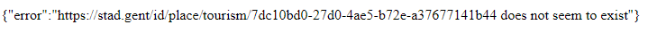
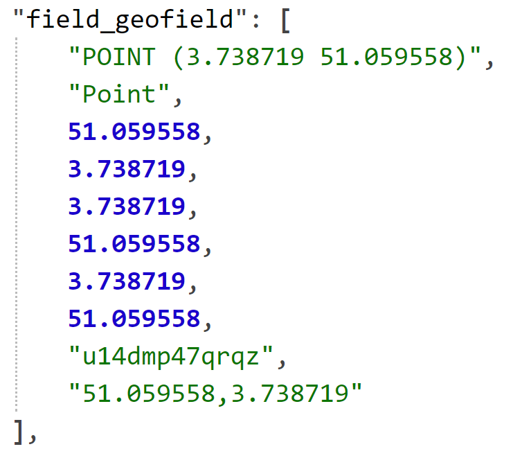

# Feedback Linked Open Data - Visit Gent

Als we [https://visit.gent.be/en/lod/poi](https://visit.gent.be/en/lod/poi) overlopen blijken er enkele problemen te zijn met het json-ld document.

- Ten eerste geven alle urls, die als id dienen, steeds een gelijkvormig error bericht terug.
  Zo geeft [https://stad.gent/id/place/tourism/7dc10bd0-27d0-4ae5-b72e-a37677141b44](https://stad.gent/id/place/tourism/7dc10bd0-27d0-4ae5-b72e-a37677141b44), die het Ibis hotel voorstelt, het volgende terug: 

- Ten tweede bevat de json-ld voor elk **point of interest** verschillende items (dezelfde id). Deze bevatten bijna volledig dezelfde data, het enige verschil dat we vonden is dat het object van **scheme:url** naar dezelfde pagina wijst maar in een andere taal. Zo staan er dus veel duplicate triples in het bestand waardoor die onnodig groot wordt.

- Ten derde hebben ContactPoints van een point of interest ook een **scheme:url** en **foaf:page**, deze verschillen echter en geven beide een 404 statuscode.

- Ten vierde hebben timestamps voor elke taal een entry ook al is er geen verschil.

- Ten slotte kan veel van de data ook niet geïnterpreteerd worden doordat ontologieën niet vermeld zijn of niet bestaan.

- Deze data is om verschillende reden niet te interpreteren. Zo geeft [https://schema.org/field_geofield](https://schema.org/field_geofield) een 404 terug. Bovendien is het onmogelijk te weten welke van de 10 verschillende waarden te gebruiken en wat die dan precies voorstellen.
